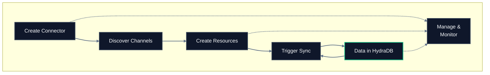

## Lifecycle



## Endpoint reference

| Endpoint | Method | Purpose | Async? |
|---|---|---|---|
| [`/v2/connectors`](/api-reference/endpoint/create-connector) | `POST` | Create a new connector | No |
| [`/v2/connectors`](/api-reference/endpoint/list-connectors) | `GET` | List all connectors | No |
| [`/v2/connectors/:id`](/api-reference/endpoint/get-connector) | `GET` | Get connector details | No |
| [`/v2/connectors/:id`](/api-reference/endpoint/delete-connector) | `DELETE` | Delete a connector | No |
| [`/v2/connectors/:id/discover`](/api-reference/endpoint/discover-channels) | `GET` | Discover available resources (Slack channels, GitHub repos, Notion databases) | No |
| [`/v2/connectors/:id/sync`](/api-reference/endpoint/trigger-connector-sync) | `POST` | Trigger a manual sync | Yes |
| [`/v2/connectors/:id/resources`](/api-reference/endpoint/list-connector-resources) | `GET` | List connector resources | No |
| [`/v2/connectors/:id/resources`](/api-reference/endpoint/create-connector-resource) | `POST` | Add a resource to sync | No |
| [`/v2/connectors/:id/resources/:resource_id`](/api-reference/endpoint/delete-connector-resource) | `DELETE` | Remove a resource | No |

## Typical call sequence

For a new connector:

```
1. POST   /v2/connectors                              → create connector with credentials
2. GET    /v2/connectors/:id/discover                 → list available resources
3. POST   /v2/connectors/:id/resources                → add resources to sync
4. POST   /v2/connectors/:id/sync                     → trigger first sync (optional)
5. POST   /recall/full_recall with search_apps: true  → query synced data
```

For ongoing management:

```
GET    /v2/connectors               → list all connectors
GET    /v2/connectors/:id           → check connector status
GET    /v2/connectors/:id/resources → see which resources are configured
DELETE /v2/connectors/:id/resources/:resource_id → stop syncing a resource
DELETE /v2/connectors/:id           → remove connector entirely
```

## Key concepts

**Connector** – A configured link to an external provider. Holds credentials and sync settings.

**Provider** – The external application type, such as `slack`, `notion`, or `github`. Each provider has specific authentication requirements and resource types.

**Resource** – A specific data source within the provider, such as a Slack channel, Notion database, or GitHub repository. Each resource is synced independently.

**Sync** – The process of pulling data from the provider into HydraDB. Runs automatically on schedule or triggered manually.

**Discover** – Queries the provider to list available resources you can add.

## Authentication types

| Type | Description | Example use |
|---|---|---|
| `api_token` | Single token authentication | Slack bot tokens (`xoxb-...`), GitHub PATs (`ghp_...`), Notion integration tokens |
| `client_secret` | OAuth client credentials | Services using client ID + secret |
| `static_bundle` | Multiple credential fields | Complex auth with multiple tokens |

## Supported providers

| Provider | Resource types | What gets synced |
|---|---|---|
| `slack` | Channels (public and private) | Messages |
| `notion` | Databases and pages | Page content |
| `github` | Repositories | Issues |

## Related sections

- [Essentials: Connectors](/essentials/connectors) – conceptual guide and setup walkthrough
- [Essentials: App Sources](/essentials/app-sources) – manual app data ingestion
- [API Reference: Recall](/api-reference/endpoint/full-recall) – querying synced data
